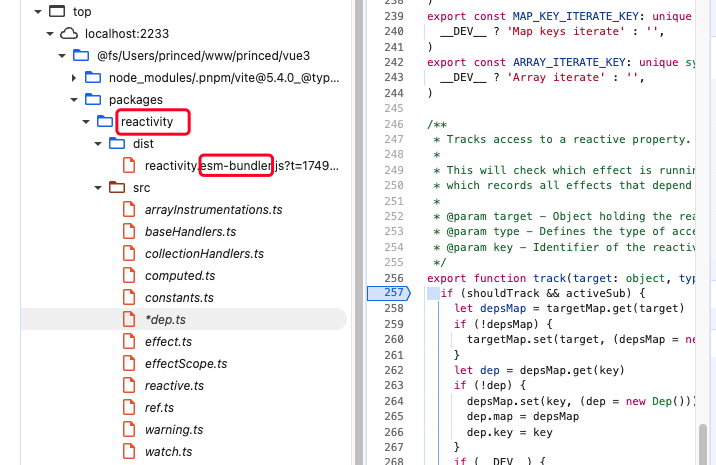

# vue源码编译

.github/contributing.md

npm run build -- -s reactivity

npm run build -- -s runtime-core

`nr dev <模块名> -f <outputFormat>` (通过 source 面板可以查看)

eg: nr dev reactivity -f esm-bundler



# 项目修改

package.json修改

```
"vite": "catalog:",
"vue": "workspace:*",
"@vitejs/plugin-vue": "catalog:",
```

npm run build -- -s  模块名？

npm run dev 模块名？ -- -f esm-bundler reactivity

# 调试compiler

1. 在项目工程中创建 test 测试文件
2. 测试文件中引入compiler相关模块
3. 执行 `npm run test <测试文件>` 进行测试

或

1. 创建 js 文件
2. 引入 compiler 的dist文件
3. 执行 node debug
